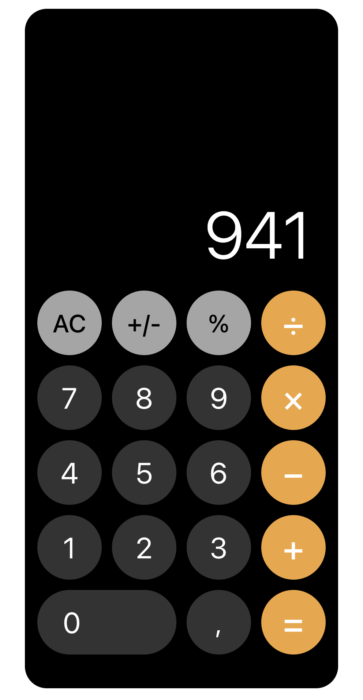

# iOS Calculator UI Clone

직무 부트캠프 '코멘토' 과제물의 일환으로 HTML과 SCSS를 활용하여 애플(iOS) 계산기 UI를 구현한 프로젝트입니다. <br/>
BEM 네이밍 컨벤션과 최신 SCSS 문법(`@use`, `Dart Sass`)을 적용하여 유지보수 가능한 코드를 작성하는 데 주력했습니다.

## Preview



<br/>

## Tech Stack

- HTML5: 시맨틱 마크업 구조
- SCSS: Dart Sass, BEM Naming
- Layout: CSS Grid(키패드), Flexbox(정렬)
- Package Manager: NPM (Sass 컴파일 환경 구축)

<br/>

## Folder Structre

```
ios-calculator/
├── 📂 assets/                 # 이미지 정적 파일
├── 📂 styles/
│   ├── 📂 base/
│   │   ├── _reset.scss        # 브라우저 기본 스타일 초기화
│   │   └── _variables.scss    # 색상 팔레트, 테마, 폰트 변수 정의
│   ├── 📂 mixins/
│   │   └── _mixins.scss       # Flexbox 유틸리티 함수 및 믹스인
│   ├── main.scss              # SCSS entry point
│   └── style.scss             # 계산기 컴포넌트별 상세 스타일링
├── index.html                 # html 마크업
└── style.css                  # 컴파일된 최종 CSS 결과물
└── package.json               # npm 스크립트 설정
```

<br/>

## Key Features & Technical Decisions

**1.SCSS Architecture**

- `@use` 모듈 시스템: 기존 `@import` 방식의 문제점(네임스페이스 오염 등)을 해결하기 위해 최신 Dart Sass 표준인 `@use`를 사용했습니다.

- 변수 관리 (`_variables.scss`): 색상 코드(Palette)와 역할(Theme)을 분리하여, 추후 유지보수/확장이 용이하도록 설계했습니다.

- Sass map & Function: 자주 사용하는 Flexbox 속성을 Map으로 정의하고, `_get-flex-value` 함수를 통해 단축 키워드를 실제 CSS 값으로 매핑하여 작성 효율을 높였습니다.

**2. Layout (Grid & Flex)**

- Grid: 5행 4열의 계산기 레이아웃 배치를 위해 `grid-template-`과 `gap`을 활용했습니다.
  <br/>특히 '0' 버튼의 경우 grid-column 속성을 사용하여 2칸을 차지하도록 구현했습니다.

- Flexbox: 버튼 내부의 텍스트 정렬과 전체 컨테이너의 중앙 정렬에는 flex 믹스인을 활용하여 직관적으로 배치했습니다.

**3. Typography**

- System Font Stack: 별도의 웹 폰트 로딩 없이 애플 기기 고유의 경험을 제공하기 위해 `-apple-system, BlinkMacSystemFont`를 최우선으로 적용했습니다.
  <br/>(개발자 도구 기준 .SF NS 렌더링 확인)

 <br/>

## Getting Started

**1. Installation**

프로젝트를 클론하고 필요한 의존성(Sass)을 설치합니다.

```bash
git clone https://github.com/vlmbuyd/ios-calculator.git
npm install
```

**2. Run(Compile SCSS)**

실시간으로 SCSS 변경 사항을 감지하여 CSS로 컴파일합니다.

```bash
npm run sass
```
